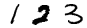
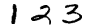
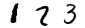
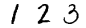
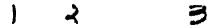
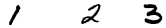
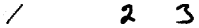
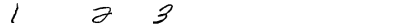
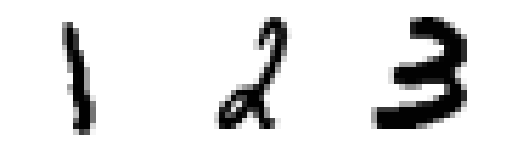
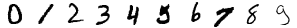

# Getting started with Collagen

Collagen is a program that allows to visualize examples of a given set
of images - a so-called *dataset* - as well as to generate new
variants of the given images for the purpose of training classifiers
and generative deep learning models.

Using the [MNIST](http://yann.lecun.com/exdb/mnist/) database of
handwritten digits, for example, as a base, the example digits defined
in MNIST can be visualized and used for generating new variants by a
process called *data augmentation*.

Beside a python package Collagen contains a command line tool for
generating, saving and inspecting examples of image sequences and
grids.  It is helpful for experimenting with image augmentation
pipelines and for inspecting the characteristics of the generated
images.  Finally it can be used for evaluating the the models trained
with datasets generated by Collagen or some other tool.


#### A simple example

Let us start with a very simple example:

```python
collagen sequence 123
```

An image representing the digit sequence `123` is generated, saved and
shown:



Executing the command several times results in three different images:

<br/>
<br/>


We can variate the spacing between the digits following a uniform
distribution over a range determined by two limits using the parameter
`--spacing-range <INTEGER INTEGER>`. The inteter specify the minimal
and maximal allowed space between the digits:

```python
collagen sequence 123 --spacing-range 10 100
```

<br/>
<br/>


With different spaces different image width result.  If a fixed width
is required, it can be specified on the command line using the option
`--image-width Integer`:

```python
collagen sequence 123 --spacing-range 10 100 --image-width 400
```

<br/>
<br/>


The given width, however, has to be large enough for the given number
of digits and maximal spacing.


#### Scaling the generated image

Sometimes a larger image size is desirable to make the evaluation of a
generated sequence easier.  For this purpose we can use the `--scale
INTEGER` option, which allows to specify an integer scale factor for
the image:

```python
collagen sequence 123 --scale 8
```




#### Specifying datasets

Beside MNIST other datasets can be used.  For testing the generation
of the sequence images the `digits5x3` dataset for example might be
helpful.  It only contains one 5x3 pixel large shape per digit and has
a grey background which makes it easy to see the spaces.  Let's
experiment with spaces between 1 and 3 pixel wide. As a size of 5
pixel is pretty small, we use a scaling factor of 10:

```python
collagen sequence 123 --dataset digits5x3 --spacing-range 1 3 --scale 10
```


The minimal width for this kind of sequence would be `3 * 3 + 2 * 3 =
15`. What happens when we try to use a smaller image width, lets say 14?

```python
collagen sequence 123 --dataset digits5x3 --spacing-range 1 3 --image-width 14 --scale 10 

Generating an image of digit sequence 123

ERROR The given image width of 14 is too small!

  The minimum width is (3 + 3) * 3 = 15.

```

An error is thrown. 

A Width of 15, however, should be enough:


```python
collagen sequence 123 --dataset digits5x3 --spacing-range 1 3 --image-width 15 --scale 10
```


The first randomly sized space is one, the second three pixel wide.
The right side of the image therefore is filled with a two pixel wide
empty space.


#### Selecting the subset of the datasets

To evaluate machine learning algorithms they are trained and evaluated
on different subsets of the datasets.  In most cases there are at
least two subsets.  MNIST, for example, is divided into a `train` and
a `test` set.  In order to select one of the two subsets the option
`--subset [train|test]` can be used:

```python
collagen sequence 0123456789 --subset test
```



Of course, both subsets of MNIST consist out of a very large number of
similar shapes, so that the difference between the subsets is not
really observable for a human user, who already learned to categorize
digits.


#### The data format

Internally Collagen uses 32-bit floating point numpy arrays to
represent images.


#### Image augmentation

Finally there is a parameter for image augmentation.  This, however,
is beyond the scope of the *getting started* section and will be
explained on the [next page](image-augmentation.md).


#### Help

To have an overview over all possible parameter and options, use
`collagen sequence --help`:

```python
collagen sequence --help

Usage: collagen sequence [OPTIONS] SEQUENCE

  Generate an image that contains the sequence of given numbers, spaced
  randomly using an uniform distribution.

Options:
  --spacing-range <INTEGER INTEGER>...
                                  Min:max spacing between digits.
  --image-width INTEGER           Width of generated image in pixels.
  --dataset TEXT                  Dataset of digit samples.
  --subset [train|test]           Subset of the dataset.
  --spec FILENAME                 A file with a dataset specification.
  --scale INTEGER                 Integer scale factor to enlarge the images.
  --dont-show                     Do not show the generated image.
  -h, --help                      Show this message and exit.
```

