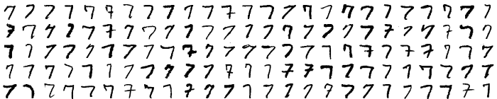
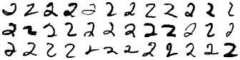
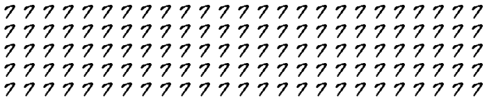
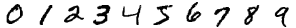
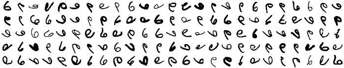
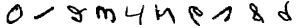

# Image Augmentation

For machine learning and character recognition the number and
variation of the samples used to train the recognition algorithms is
of greatest importance.  Beside the digit shapes found in some dataset
like MNIST, data augmentation is a very helpful tool to generate
unlimited variations on the base of the models found in the dataset.

To have an idea about the digit variations represented in the MNIST
dataset, let us introduce another command line tool: `collagen grid`.


## Collagen Grid

Let us start by generating a grid of random shapes representing the
digit 7:


```python
collagen grid 7
```



The `collagen grid` command has similar parameters as `collagen sequence`:

```python
collagen grid --help

Usage: collagen grid [OPTIONS] DIGIT

  Generate an image displaying a grid of randomly selected shapes for DIGIT.

Options:
  --width INTEGER        The width of the grid.
  --height INTEGER       The height of the grid.
  --dataset TEXT         Dataset of digit samples.
  --subset [train|test]  Subset of the dataset.
  --spec FILENAME        A file with a dataset specification.
  --scale INTEGER        Integer scale factor to enlarge the images.
  --dont-show            Do not show the generated image.
  -h, --help             Show this message and exit.
```

The only real difference are the `--width INTEGER` and `--height INTEGER` 
options, which control the size of the generated grid:

```python
collagen grid 2 --width 12 --height 3
```




## The *MNIST1* Dataset

Image augmentation is about generating variations of existing shapes.
Using the MNIST dataset it would be difficult to see the difference
between variations found in the dataset itself and those generated via
image augmentation.  We therefore use another dataset - MNIST1 -,
which was extracted from the original MNIST training dataset by only
selecting the first possible shape for every digit.  For this reason
all digits selected from MNIST1 have the same shape:

```python
collagen grid 7 --dataset mnist1
```



The other digits of the MNIST1 dataset have the folloging forms:

```python
collagen sequence 0123456789 --dataset mnist1
```




## Image Augmentation


Collagen is based on the Python-based open-source package collection
for mathematics, science, and engineering
[SciPy](https://www.scipy.org/).  The images are implemented as arrays
based on the SciPy's array package [NumPy](http://www.numpy.org/)
while the augmentation operations are based on the SciPy image
processing toolkit [scikit-image](http://scikit-image.org/) and the
multi-dimensional image processing package
[scipy.ndimage](https://docs.scipy.org/doc/scipy/reference/ndimage.html).

The following image augmentation operations are defined:

- dilate
- distort
- embed
- erode
- erode-dilate
- mirror
- pad
- pipeline
- rescale
- rotate
- shear
- translate
- unpad
- zoom


# hierweiter

TODO: How to use from python

TODO: How to extend with new augmentation operations


## Image Augmentation

Collagen supports a simple file format to implement augmentation
pipelines.  The code above for example can be translated to the
following specification:

```yaml
augmentation-pipeline:

  - mirror:
      probability: 0.5
      direction: y

  - rotate:
      probability: 0.5
      angle: 90
```


Let's save the commands to the file `augment000.yaml` and pass it as
a parameter to `collagen grid 6`:

```python
collagen grid 6 --spec augment000.yaml
```

Here is the result:



The generated pattern is visually fascinating - but probably not the
right tool for generating a training set for a digit recognition
application, as also the sequence `0123456789` shows:

```python
collagen sequence 0123456789 --dataset mnist1 --spec augment000.yaml
```

Which digit represents a six?  Which one a nine?



So we better explore how the defined operations can be used more
adequately.  Let us approach them one by one, starting with the
skewing operation.

#### dilate

todo

#### distort

todo

#### embed

todo

#### erode

todo

#### erode-dilate

todo

#### mirror

todo

#### pad

todo

#### pipeline

todo

#### rescale

todo

#### rotate

todo

#### shear

todo

#### translate

todo

#### unpad

todo

#### zoom


